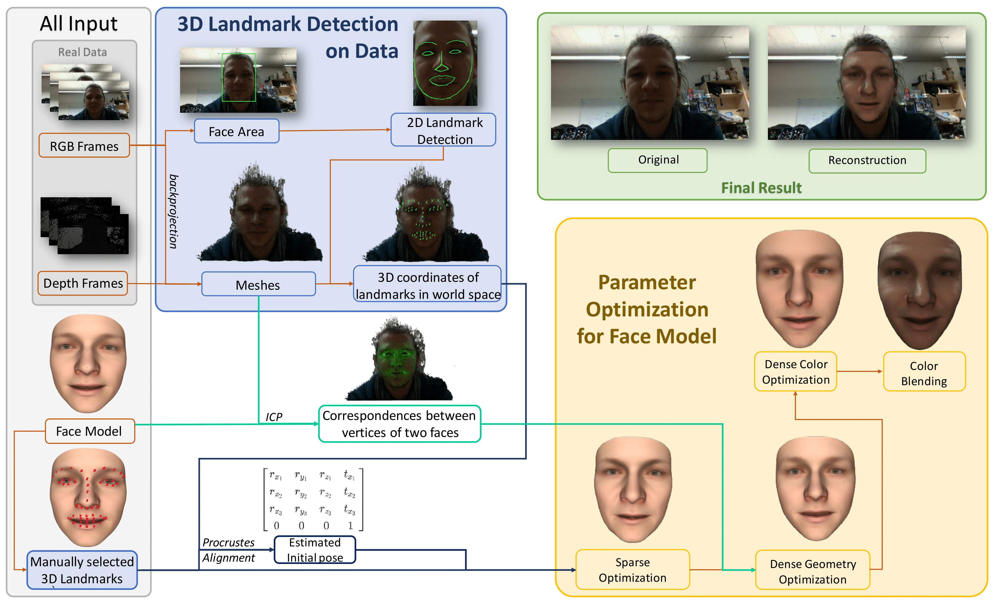

# RGBDFaceReconstruction

## Introduction 

This is a project which reads RGB-D image sequence and reconstruct the 3D face by using Basel Face Model 2019.
For more detail please read our **[Final Report](Reports/FinalReport.pdf)**. Weekly reports also under [Reports](Reports/).

## Overview



## Resource

### Parametric Face Model

We use Parametric Face Model to reconstruct the face shape, expression and color.
You can the Basel Face Model 2019 [here](https://faces.dmi.unibas.ch/bfm/bfm2019/restricted/model2019_face12.h5)
as the basis for running the program.

### Dataset

- Our own dataset recorded by Intel Realsense L515
    - Set `#define DATASET_REALSENSE 1`, and others to `0`
    - [Extracted frames](https://syncandshare.lrz.de/getlink/fi97e2faKMB3kjkEEY4Hmj2c/RealSense.zip) (Deprecated!)
    - [Raw bag file](https://syncandshare.lrz.de/getlink/fiW6UXZqNZviEy1XJx1evAe7/20220125_183911.bag) (Deprecated!)
- Our own dataset recorded by Kinect v2 (with aligned colour frames)
    - Set `#define DATASET_KINECT_V2 1`, and others to `0`
    - [Extracted frames](https://syncandshare.lrz.de/getlink/fiSAbsoQvHzdEdGxKZKwFRew/Kinect.zip) (Deprecated!)
- ~~[FaceGrabber](https://www.ei.tum.de/mmk/facegrabber/)~~
    - Set `#define DATASET_FACEGRABBER 1`, and others to `0`
    - Depth and Colour frame are not aligned

## Get started

### Setup Tutorial

**Note: You may use vcpkg to install dependencies or you need build all dependencies (libraries) by yourself!**

1. Clone the repository 
2. Install [Eigen](https://gitlab.com/libeigen/eigen/-/archive/3.4.0/eigen-3.4.0.zip) Library
3. Install [DLib](http://dlib.net/files/dlib-19.22.zip) Library
4. Install [OpenCV](https://github.com/opencv/opencv/archive/refs/tags/4.5.5.zip) Library
5. Install [HDF5](https://github.com/HDFGroup/hdf5) Library
6. Install [Ceres](https://github.com/ceres-solver/ceres-solver) Library
7. Install [PCL](https://github.com/PointCloudLibrary/pcl) Library
8. (if *WINDOWS*) Copy FreeImage Library to `/Libs` (Get it on Moodle)
9. Put the dataset into `/Data`
10. Put the parametric face model `h5` file into `/Model/BFM`
11. Get the model file of DLib and put it into `/Model/DLib` (Get it [here](http://dlib.net/files/shape_predictor_68_face_landmarks.dat.bz2))


### Setup Tutorial by vcpkg (Recommend)

Before you start make sure that [`vcpkg`](https://vcpkg.io/en/index.html) is already avaliable on your computer. If not, please follow the instruction [here](https://vcpkg.io/en/getting-started.html).
Input `vcpkg` in your console to test whether it is set up.

For 64 bit Windows need to add an additional option in the install command. 
Like `vcpkg --triplet x64-windows install pcl`.

1. Install Eigen3 via `vcpkg install eigen3` 
2. Install DLib via `vcpkg install dlib` 
3. Install OpenCV via `vcpkg install opencv` 
4. Install HDF5 via `vcpkg install hdf5[cpp]` 
5. Install Ceres via `vcpkg install ceres`
6. Install PCL via `vcpkg install pcl`
7. Install FreeImage via `vcpkg install freeimage` (Linux only)
8. Input `vcpkg integrate install` in console
9. Change the `path` to your `vcpkg` manually in [`CMakeLists.txt`](./CMakeLists.txt) *Line 3*

## Project structure

The project folder should look like as following.
```
.
├── Libs
│   ├── Eigen
│   │   └── ...
│   └── FreeImage-3.18.0 (*WINDOWS*)
│   │   └── ...
│   ├── DLib
│   │   └── ...
│   └── OpenCV
│   │   └── ...
├── Data
│   ├── Kinect
│   │   └── ...
│   ├── RealSense
│   │   └── ...
│   └── FaceGrabberDB (should keep the original structure)
│   │   └── ...
├── Model
│   ├── DLib
│   │   └── shape_predictor_68_face_landmarks.dat
│   │       (**Should download it and put it here manually**)
│   ├── BFM
│   │   ├── Landmarks68_BFM.anl
│   │   └── model2019_face12.h5
│   │       (**Should download it and put it here manually**)
│   └── OpenCV
│       ├── opencv_face_detector_uint8.pb
│       └── opencv_face_detector.pbtxt
├── CMakeLists.txt
├── Eigen.h
├── FreeImageHelper.cpp
├── FreeImageHelper.h
├── LandmarkDetector.cpp
├── LandmarkDetector.h
├── main.cpp
├── OpenCVImgCropper.cpp
├── OpenCVImgCropper.h
├── ProcrustesAligner.h
├── VirtualSensor.h
├── ...
└── README.md
```

## Members
 - Tong Yan Yumi Chan
 - Daniel Schubert
 - Chang Luo
